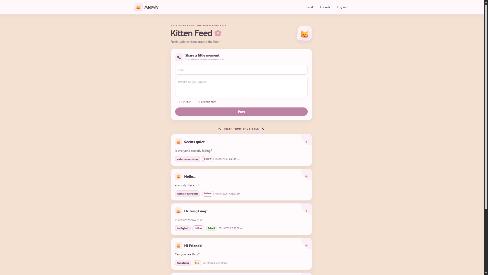

<h1 align="center"><span aria-hidden="true">🐱</span> Meowly</h1>

<p align="center">
  
</p>

<p align="center">Social Media for Kitties</p>

## Features

- Create an account and log in
- Share posts with everyone or friends
- Browse the feed and follow other users
- View your friends
- Responsive kitten-inspired interface

## Tech stack

- React and JavaScript
- Vite
- React Router
- Bootstrap and custom CSS
- Supabase for authentication and database

## API endpoints

**Base URL:** `https://soc-med-api-production.up.railway.app`

All endpoints that require authentication expect the Supabase access token in this header:

```http
Authorization: Bearer <access_token>
```

| Method | Path | Authentication | Description |
| --- | --- | --- | --- |
| `GET` | `/` | No | Serves the API server's `index.html` page. |
| `POST` | `/auth/signup` | No | Creates an account. JSON body: `{ "username": "...", "email": "...", "password": "..." }`. Returns the created user. |
| `POST` | `/auth/login` | No | Signs in. JSON body: `{ "email": "...", "password": "..." }`. Returns a session containing the access token. |
| `GET` | `/whoami` | Yes | Returns the authenticated user's `userId`, `email`, and `role`. |
| `GET` | `/follow` | Yes | Returns the current user's follow relationships, including `followed_id` and the followed user's `id` and `username`. |
| `POST` | `/follow` | Yes | Follows a user. JSON body: `{ "followed_id": "<user-id>" }`. Returns `201` on success and `409` if already following. |
| `GET` | `/friends` | Yes | Returns users with a mutual follow relationship with the current user, including their `id`, `username`, and `email`. |
| `GET` | `/posts` | Yes | Returns public posts and friends-only posts from the current user and mutual friends, newest first. |
| `POST` | `/posts` | Yes | Creates a post. JSON body: `{ "title": "...", "content": "...", "visibility": "public" }`; visibility can be `public` or `friends`. Returns `201` when created. |
